cl /d1 reportSingleClass类名 文件名

- 空类的大小为1字节
- 一个类中，虚函数本身、成员函数（包括静态与非静态）和静态数据成员都是不占用类对象的存储空间。
- 对于包含虚函数的类，不管有多少个虚函数，只有一个虚指针vptr的大小。
- 普通继承，派生类继承了所有基类的函数与成员，要按照字节对齐来计算大小
- 虚函数继承，不管是单继承还是多继承，都是继承了基类的vptr。(32位操作系统4字节，64位操作系统 8字节)！
- 虚继承,继承基类的vptr。会增加一个虚基指针vbptr指向vtable虚表

## 1.原则1

```c++
#include<iostream>
using namespace std;
class A{};
int main()
{
    cout<<sizeof(A)<<endl;
    return 0;
}
```

## 2.原则2

```c++
/**
 * @brief 静态数据成员
 * 静态数据成员被编译器放在程序的一个global data members中，它是类的一个数据成员，但不影响类的大小。不管这个类产生了多少个实例，还是派生了多少新的类，静态数据成员只有一个实例。静态数据成员，一旦被声明，就已经存在。 
 */
#include<iostream>
using namespace std;
class A
{
    public:
        char b;
        virtual void fun() {};
        static int c;
        static int d;
        static int f;
};

int main()
{
    /**
     * @brief 8  字节对齐、静态变量不影响类的大小、vptr指针=4
     */
    cout<<sizeof(A)<<endl; 
    return 0;
}
```

## 3.原则3

```c++
/**
 * @brief 对于包含虚函数的类，不管有多少个虚函数，只有一个虚指针,vptr的大小。
 */
#include<iostream>
using namespace std;
class A{
    virtual void fun();
    virtual void fun1();
    virtual void fun2();
    virtual void fun3();
};
int main()
{
    cout<<sizeof(A)<<endl; // 4
    return 0;
}
```

## 4.原则4与5

```c++
/**
 * @brief 1.普通单继承,继承就是基类+派生类自身的大小(注意字节对齐)
 * 注意：类的数据成员按其声明顺序加入内存，与访问权限无关，只看声明顺序。
 * 2.虚单继承，派生类继承基类vptr
 */

#include<iostream>
using namespace std;
class A
{
    public:
        char a;//1
        long long b;//8
};//16

/**
 * @brief 此时B按照顺序：
 * char a
 * long long b
 * short a
 * long b
 * 根据字节对齐8+8+4+4=24
 */
class B:A
{
    public:
        short a;
        long b;//4
};
class C
{
    A a;
    char c;
};
class A1
{
    virtual void fun(){}
};
class C1:public A1
{
};
class C2 :public A1
{
    virtual void fun() {}
};


int main()
{
    cout<<sizeof(A)<<endl; // 16
    cout<<sizeof(B)<<endl; // 24
    cout<<sizeof(C)<<endl; // 24
    /**
     * @brief 对于虚单函数继承，派生类也继承了基类的vptr，所以是4字节
     */
    cout<<sizeof(C1)<<endl; // 8 
    return 0;
}
```
> 对齐：不和父类成员对齐
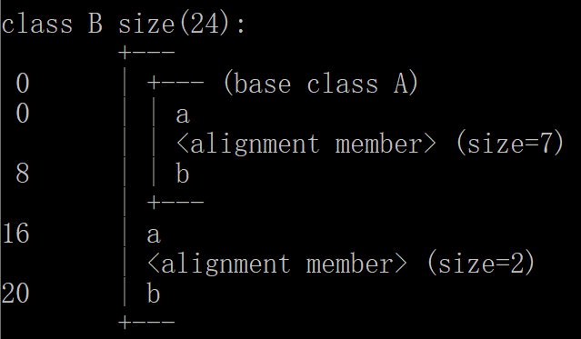

> 对齐：和父类成员对齐
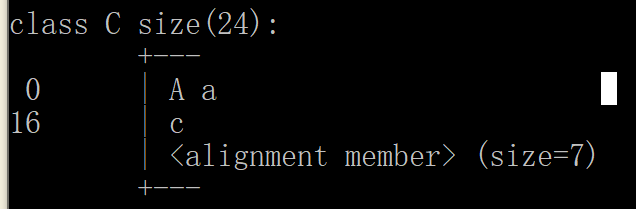

> 
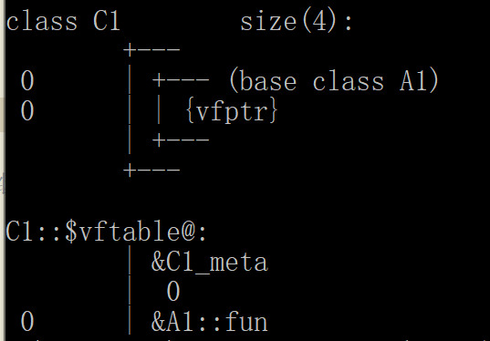
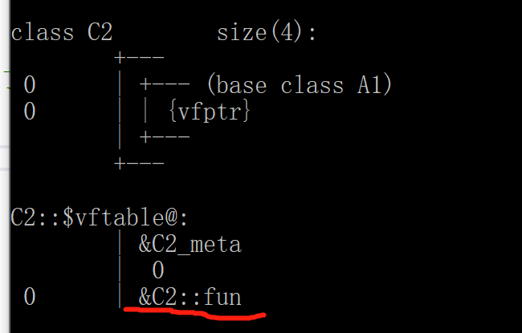
C2重写了父类函数，因此虚表修改成了自己的函数


## 5.原则6

```c++
#include<iostream>
using namespace std;
class A
{
    virtual void fun() {}
};
class B
{
    virtual void fun2() {}
};
class C : virtual public  A, virtual public B
{
    public:
        virtual void fun3() {}
};
class D : public  A, virtual public B
{
    public:
        virtual void fun3() {}
};
class E : public  A, public B
{
    public:
        virtual void fun3() {}
};
class F : virtual public  A, public B
{
    public:
        virtual void fun1() {}
};
//error A不可访问
// class G : public  A, public C
// {
//     public:
//         virtual void fun1() {}
// };
class G : public  A, public D
{
    public:
        virtual void fun1() {}
};
class H : virtual public  A, virtual public C
{
    public:
        virtual void fun1() {}
};
//error A不可访问
// class I : public  A, virtual public C
// {
//     public:
//         virtual void fun1() {}
// };
class I : public  A, virtual public D
{
    public:
        virtual void fun1() {}
};
class J : virtual public  A, public C
{
    public:
        virtual void fun1() {}
};//和只继承C一样

int main()
{
    /**
     * @brief 4 4 16  派生类虚继承多个虚函数，会继承所有虚函数的vptr
     */
    cout<<sizeof(A)<<" "<<sizeof(B)<<" "<<sizeof(C);

    return 0;
}
```
vbptr-虚基指针，
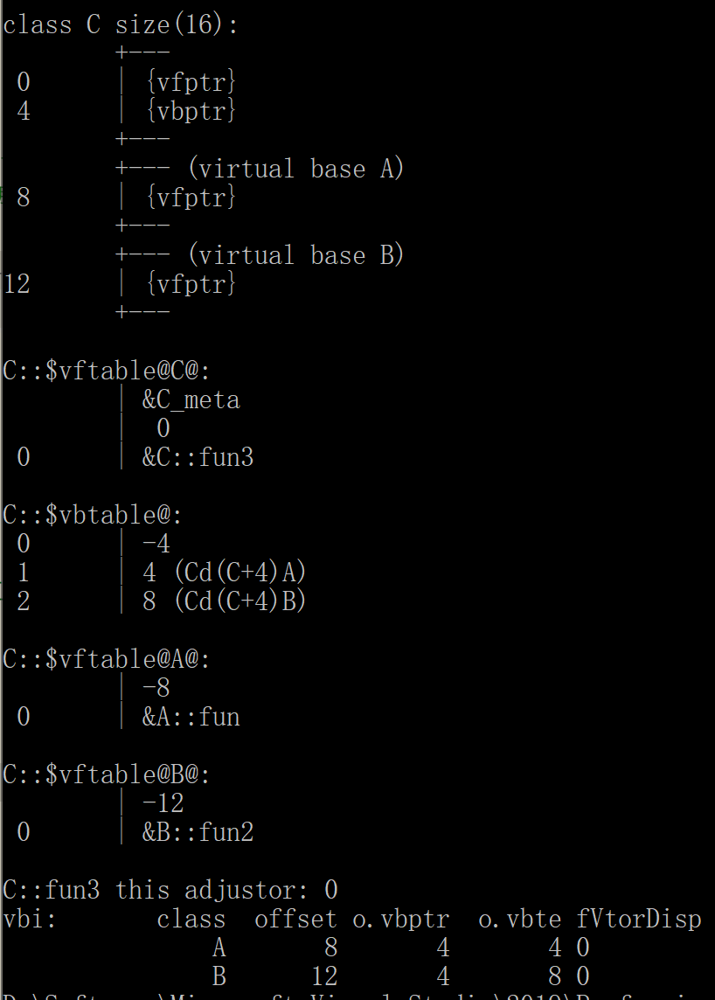
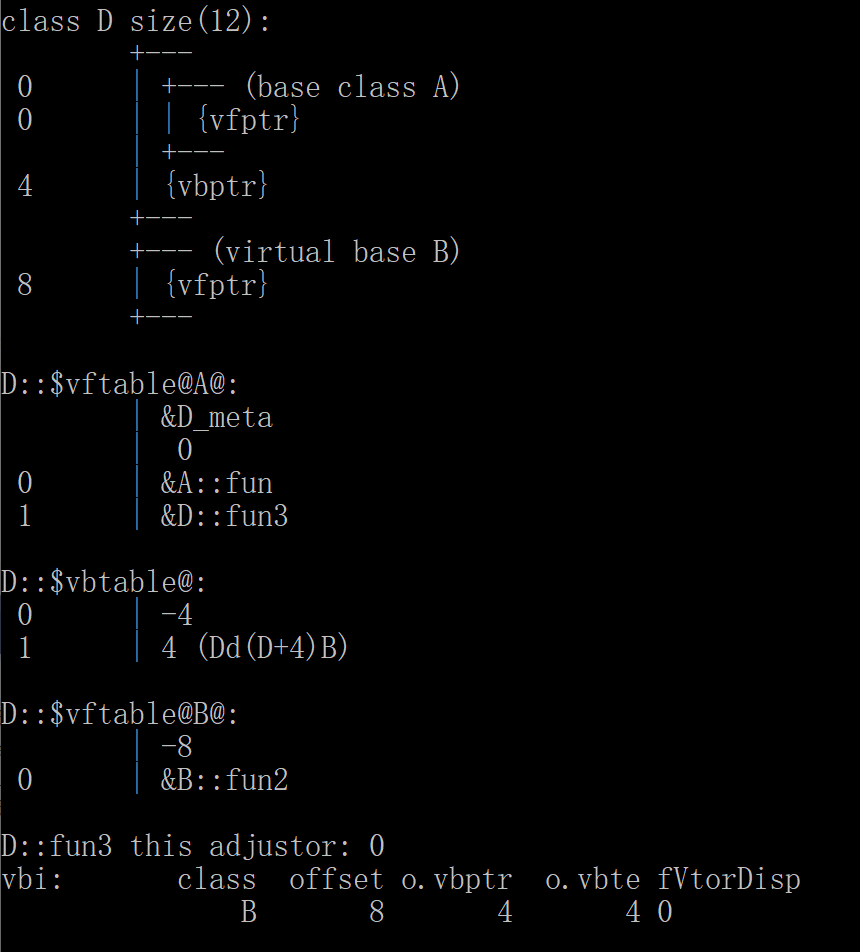
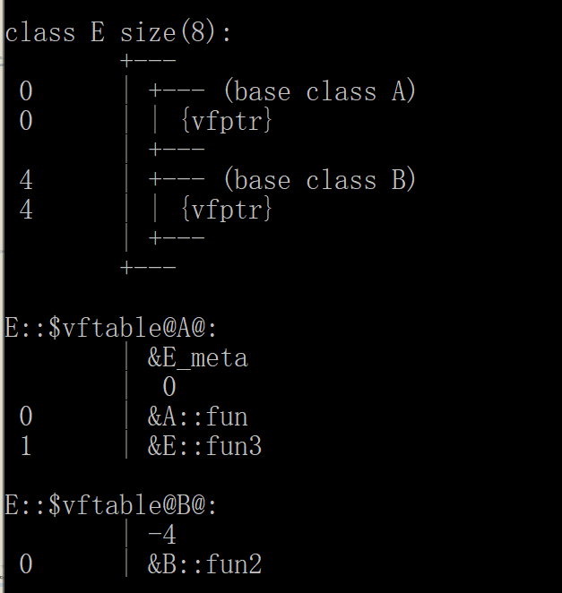
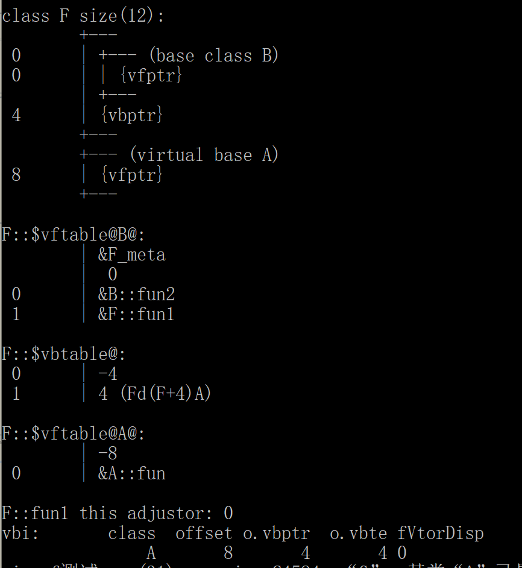
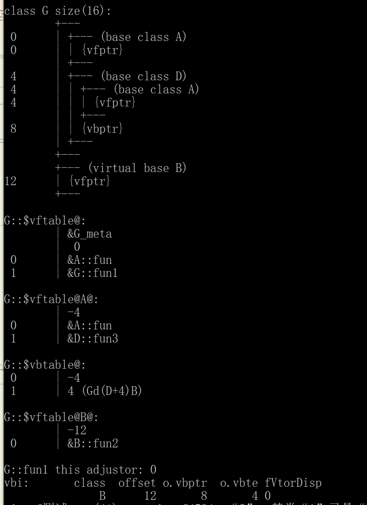
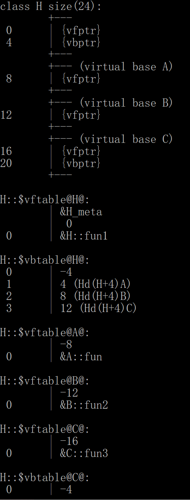
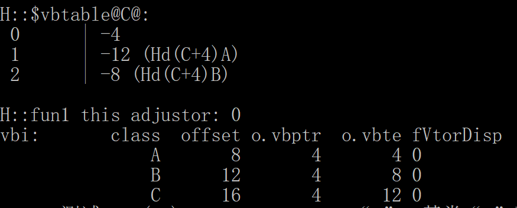
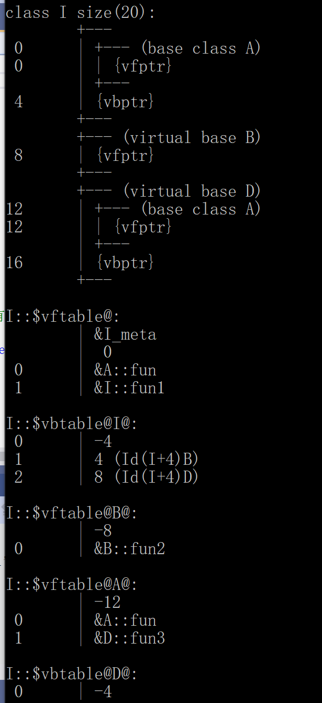
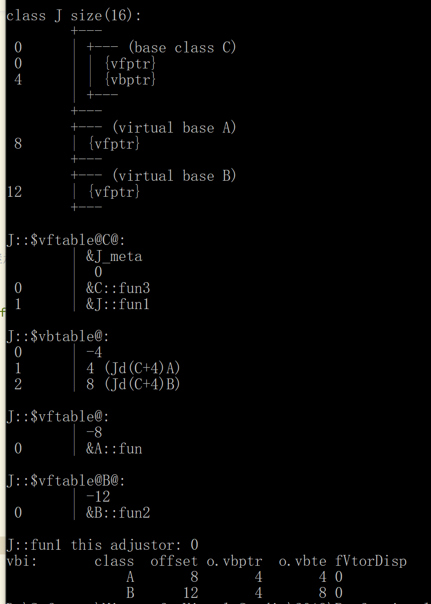