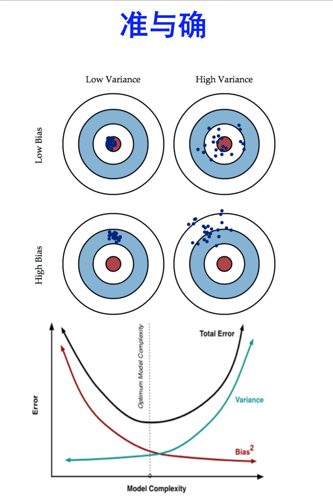

##### 偏差（bias）vs方差（variance）vs误差（error)
来源 [机器学习中的 Bias（偏差）、Error（误差）、Variance（方差）](https://www.zhihu.com/question/27068705)

**准**：bias描述根据样本拟合出的模型输出的预测结果的期望和样本真实结果之间的差距（在样本上拟合的好不好）。low bias，就要复杂化模型，增加模型的参数，但容易过拟合，overfitting对应上图high variance，点很分散。
**确**：varience描述的是样本上训练出来的模型在测试集上的表现，low varience需要简化模型，减少模型参数，易欠拟合，对应high bias。

如果模型没有很好的训练训练集，就是偏差过大，也就是欠拟合 如果模型很好的训练训练集，即再训练集上得到很小的错误，但在测试集上得到大的错误，这意味着模型可能是方差比较大，就是过拟合。 对于欠拟合和过拟合，是用不同的方式来处理的
**偏差大-欠拟合**
此时应该重新设计模型。因为之前的函数集里面可能根本没有包含f*。可以：
将更多的函数加进去，比如考虑高度重量，或者HP值等等。或者考虑更多次幂、更复杂的模型。如果此时强行再收集更多的data去训练，这是没有什么帮助的，因为设计的函数集本身就不好，再找更多的训练集也不会更好。

**方差大-过拟合**
简单粗暴的方法：更多的数据
正则化