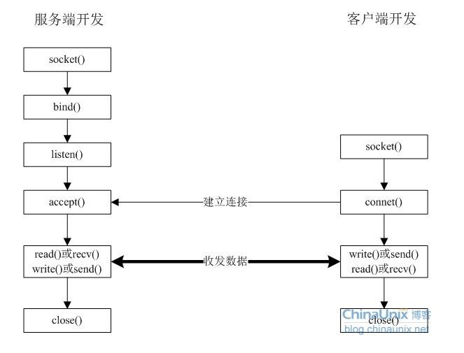

- **服务端套接字(接收) 网络中接收连接请求的套接字创建过程如下：**
>1、调用socket函数创建套接字。
int socket(int domain, int type, int protocol);
2、调用bind函数分配IP地址和端口号。
int bind(int sockfd, struct sockaddr *myaddr, socklen_t addrlen);
3、调用listen函数转为可接收请求状态。
int listen(int sockfd, int backlog);
4、调用accept函数受理连接请求。
   int accept(int sockfd, struct sockaddr *addr, socklen_t *addrlen);

- **客服端套接字(发送)**
>1、调用socket函数创建套接字。
 2、调用connect函数向服务端发送连接请求。
 int connect(int sockfd, struct sockaddr *serv_addr, socklen_t addrlen);

 